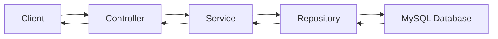

## Overview

DriveX is built on a modern **Spring Boot** architecture with a RESTful API design. The system follows a layered architecture pattern with clear separation of concerns across controllers, services, and data models.

## Technology Stack

<CardGroup cols={2}>
  <Card title="Framework" icon="leaf">
    **Spring Boot** - Core application framework with dependency injection and auto-configuration
  </Card>
  <Card title="Database" icon="database">
    **MySQL** with JPA/Hibernate for object-relational mapping
  </Card>
  <Card title="Security" icon="shield">
    **BCrypt** password encoding for secure authentication
  </Card>
  <Card title="API Design" icon="code">
    **REST** principles with JSON request/response format
  </Card>
</CardGroup>

## Architectural Layers

### Controller Layer

The controller layer handles HTTP requests and responses using Spring's `@RestController` annotation. Controllers are responsible for:

- Request validation and mapping
- Delegating business logic to services
- Returning appropriate HTTP status codes
- CORS configuration for cross-origin requests

```java
@RestController
@RequestMapping("/auth")
@CrossOrigin(origins = "*")
public class AuthController {
    private final UserService service;
    
    @PostMapping("/login")
    public ResponseEntity<User> login(@RequestBody LoginRequest request) {
        return service.login(request.getEmail(), request.getPassword())
                .map(ResponseEntity::ok)
                .orElse(ResponseEntity.status(401).build());
    }
}
```

<Note>
All controllers use `@CrossOrigin(origins = "*")` to enable CORS support for frontend applications.
</Note>

### Service Layer

The service layer contains the business logic and orchestrates data operations. Services interact with JPA repositories to perform CRUD operations and implement domain-specific workflows.

Key responsibilities:
- User authentication and registration
- Vehicle management and search
- Rental booking and status management
- Data validation and business rules

### Data Access Layer

The data access layer uses **Spring Data JPA** to interact with the MySQL database. Entity classes are annotated with JPA annotations to define:

- Table mappings (`@Entity`, `@Table`)
- Primary keys (`@Id`, `@GeneratedValue`)
- Relationships (`@OneToMany`, `@ManyToOne`)
- Column constraints and configurations

## Security Configuration

DriveX implements password encryption using BCrypt through Spring Security:

```java
@Configuration
public class SecurityConfig {
    @Bean
    public PasswordEncoder passwordEncoder() {
        return new BCryptPasswordEncoder();
    }
}
```

<Info>
BCrypt is a one-way hashing algorithm designed specifically for password storage. It includes a salt to protect against rainbow table attacks.
</Info>

## Design Patterns

### Dependency Injection

All components use constructor-based dependency injection for better testability and immutability:

```java
public AuthController(UserService service) {
    this.service = service;
}
```

### Repository Pattern

Spring Data JPA repositories provide an abstraction layer over database operations, eliminating boilerplate code.

### Entity Lifecycle Callbacks

Automatic timestamp management using JPA callbacks:

```java
@PrePersist
protected void onCreate() {
    this.createdAt = LocalDateTime.now();
}

@PreUpdate
protected void onUpdate() {
    this.updatedAt = LocalDateTime.now();
}
```

## Data Flow



1. **Client** sends HTTP request to REST endpoint
2. **Controller** receives and validates the request
3. **Service** executes business logic
4. **Repository** performs database operations via JPA
5. **Database** stores and retrieves data
6. Response flows back through the layers

## API Response Patterns

The API uses standard HTTP status codes:

- **200 OK** - Successful request with data
- **401 Unauthorized** - Authentication failed
- **409 Conflict** - Resource already exists (e.g., duplicate email)
- **404 Not Found** - Resource not found

<Warning>
The current authentication implementation does not use JWT tokens. Consider implementing token-based authentication for production deployments.
</Warning>

## Database Strategy

- **ID Generation**: `IDENTITY` strategy for auto-incrementing primary keys
- **Naming Convention**: Snake_case for database columns, camelCase in Java code
- **Cascading**: Parent entities cascade operations to child entities (e.g., Vehicle → VehicleImage)
- **Orphan Removal**: Enabled on one-to-many relationships to maintain referential integrity
