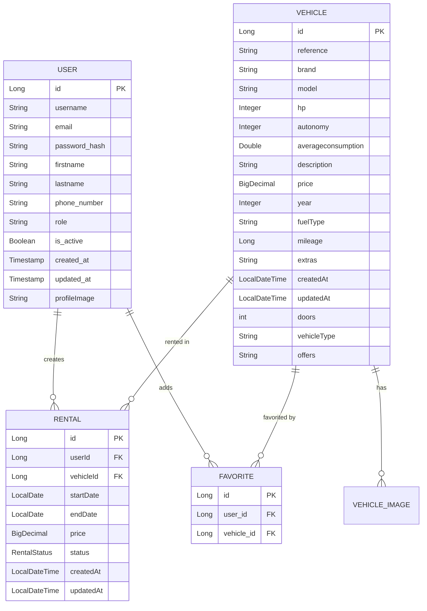

## Entity Relationship Overview

DriveX uses JPA (Java Persistence API) to manage four core entities and their relationships:



## User Entity

The User entity represents customer accounts and administrative users.

### Entity Definition

```java
@Entity
@Table(name = "users")
public class User {
    @Id
    @GeneratedValue(strategy = GenerationType.IDENTITY)
    private Long id;
    
    private String username;
    private String email;
    private String password_hash;
    
    @Column(name = "first_name")
    private String firstname;
    
    @Column(name = "last_name")
    private String lastname;
    
    private String phone_number;
    private String role;
    private Boolean is_active;
    private Timestamp created_at;
    private Timestamp updated_at;
    
    @Column(name = "profile_image")
    private String profileImage;
}
```

### Fields Reference

<ParamField path="id" type="Long">
  Primary key, auto-generated using IDENTITY strategy
</ParamField>

<ParamField path="username" type="String">
  Unique username for the user account
</ParamField>

<ParamField path="email" type="String">
  User's email address, used as login identifier
</ParamField>

<ParamField path="password_hash" type="String">
  BCrypt hashed password (never store plaintext passwords)
</ParamField>

<ParamField path="firstname" type="String">
  User's first name (maps to `first_name` column)
</ParamField>

<ParamField path="lastname" type="String">
  User's last name (maps to `last_name` column)
</ParamField>

<ParamField path="phone_number" type="String">
  Contact phone number
</ParamField>

<ParamField path="role" type="String">
  User role (e.g., "USER", "ADMIN")
</ParamField>

<ParamField path="is_active" type="Boolean">
  Account activation status
</ParamField>

<ParamField path="profileImage" type="String">
  URL to user's profile image (maps to `profile_image` column)
</ParamField>

## Vehicle Entity

The Vehicle entity represents cars and motorcycles available for rent.

### Entity Definition

```java
@Entity
@Table(name = "vehicles")
public class Vehicle {
    @Id
    @GeneratedValue(strategy = GenerationType.IDENTITY)
    private Long id;
    
    @Column(nullable = false)
    private String reference;
    
    private String brand;
    private String model;
    private Integer hp;
    private Integer autonomy;
    
    @Column(name = "average_consumption")
    private Double averageconsumption;
    
    private String description;
    private BigDecimal price;
    private Integer year;
    
    @Column(name = "fuel_type")
    private String fuelType;
    
    private Long mileage;
    private String extras;
    
    @Column(name = "created_at")
    private LocalDateTime createdAt;
    
    @Column(name = "updated_at")
    private LocalDateTime updatedAt;
    
    private int doors;
    
    @Column(name = "vehicle_type")
    private String vehicleType;
    
    private String offers;
    
    @OneToMany(mappedBy = "vehicle", cascade = CascadeType.ALL, orphanRemoval = true)
    @JsonIgnoreProperties("vehicle")
    private List<VehicleImage> images = new ArrayList<>();
}
```

### Fields Reference

<ParamField path="id" type="Long">
  Primary key, auto-generated
</ParamField>

<ParamField path="reference" type="String" required>
  Unique reference code for the vehicle (non-nullable)
</ParamField>

<ParamField path="brand" type="String">
  Vehicle manufacturer (e.g., "FERRARI", "TOYOTA")
</ParamField>

<ParamField path="model" type="String">
  Vehicle model name
</ParamField>

<ParamField path="hp" type="Integer">
  Horsepower rating
</ParamField>

<ParamField path="autonomy" type="Integer">
  Range in kilometers (for electric vehicles)
</ParamField>

<ParamField path="averageconsumption" type="Double">
  Average fuel consumption (maps to `average_consumption` column)
</ParamField>

<ParamField path="description" type="String">
  Detailed vehicle description
</ParamField>

<ParamField path="price" type="BigDecimal">
  Daily rental price
</ParamField>

<ParamField path="year" type="Integer">
  Manufacturing year
</ParamField>

<ParamField path="fuelType" type="String">
  Fuel type (e.g., "GASOLINE", "DIESEL", "ELECTRIC")
</ParamField>

<ParamField path="mileage" type="Long">
  Total kilometers driven
</ParamField>

<ParamField path="extras" type="String">
  Additional features and equipment
</ParamField>

<ParamField path="doors" type="int">
  Number of doors
</ParamField>

<ParamField path="vehicleType" type="String">
  Type of vehicle (e.g., "CAR", "MOTORCYCLE")
</ParamField>

<ParamField path="offers" type="String">
  Current promotional offers
</ParamField>

<ParamField path="images" type="List<VehicleImage>">
  One-to-many relationship with vehicle images. Cascades all operations and removes orphaned images.
</ParamField>

### Vehicle-Image Relationship

The Vehicle entity has a **one-to-many** relationship with VehicleImage:

```java
@OneToMany(mappedBy = "vehicle", cascade = CascadeType.ALL, orphanRemoval = true)
@JsonIgnoreProperties("vehicle")
private List<VehicleImage> images = new ArrayList<>();
```

<Info>
- **CascadeType.ALL**: All JPA operations (persist, merge, remove) cascade to images
- **orphanRemoval = true**: Automatically deletes images when removed from the list
- **@JsonIgnoreProperties("vehicle")**: Prevents circular reference in JSON serialization
</Info>

## Rental Entity

The Rental entity tracks vehicle reservations and bookings.

### Entity Definition

```java
@Entity
@Table(name = "rentals")
public class Rental {
    @Id
    @GeneratedValue(strategy = GenerationType.IDENTITY)
    private Long id;
    
    @Column(name = "user_id", nullable = false)
    private Long userId;
    
    @Column(name = "vehicle_id", nullable = false)
    private Long vehicleId;
    
    @Column(name = "start_date", nullable = false)
    private LocalDate startDate;
    
    @Column(name = "end_date", nullable = false)
    private LocalDate endDate;
    
    @Column(name = "price", nullable = false, precision = 10, scale = 2)
    private BigDecimal price;
    
    @Enumerated(EnumType.STRING)
    @Column(name = "status", nullable = false, length = 20)
    private RentalStatus status = RentalStatus.RESERVED;
    
    @Column(name = "created_at", nullable = false, updatable = false)
    private LocalDateTime createdAt;
    
    @Column(name = "updated_at")
    private LocalDateTime updatedAt;
    
    @PrePersist
    protected void onCreate() {
        this.createdAt = LocalDateTime.now();
        this.updatedAt = this.createdAt;
    }
    
    @PreUpdate
    protected void onUpdate() {
        this.updatedAt = LocalDateTime.now();
    }
}
```

### Fields Reference

<ParamField path="userId" type="Long" required>
  Foreign key reference to User entity
</ParamField>

<ParamField path="vehicleId" type="Long" required>
  Foreign key reference to Vehicle entity
</ParamField>

<ParamField path="startDate" type="LocalDate" required>
  Rental period start date
</ParamField>

<ParamField path="endDate" type="LocalDate" required>
  Rental period end date
</ParamField>

<ParamField path="price" type="BigDecimal" required>
  Total rental price (precision 10, scale 2 for currency)
</ParamField>

<ParamField path="status" type="RentalStatus" required>
  Current rental status, defaults to RESERVED
</ParamField>

### Rental Status Enum

The RentalStatus enum defines the rental lifecycle:

```java
public enum RentalStatus {
    RESERVED,   // Initial booking state
    ACTIVE,     // Rental in progress
    COMPLETED,  // Rental finished
    CANCELLED   // Booking cancelled
}
```

<AccordionGroup>
  <Accordion title="RESERVED">
    Initial state when a user books a vehicle. Vehicle is held but rental hasn't started.
  </Accordion>
  
  <Accordion title="ACTIVE">
    Rental is currently in progress. User has picked up the vehicle.
  </Accordion>
  
  <Accordion title="COMPLETED">
    Rental period has ended and vehicle has been returned.
  </Accordion>
  
  <Accordion title="CANCELLED">
    Booking was cancelled before becoming active.
  </Accordion>
</AccordionGroup>

### Automatic Timestamps

The Rental entity uses JPA lifecycle callbacks for automatic timestamp management:

```java
@PrePersist
protected void onCreate() {
    this.createdAt = LocalDateTime.now();
    this.updatedAt = this.createdAt;
}

@PreUpdate
protected void onUpdate() {
    this.updatedAt = LocalDateTime.now();
}
```

<Tip>
The `createdAt` field uses `updatable = false` to prevent accidental modification after creation.
</Tip>

## Favorite Entity

The Favorite entity implements a many-to-many relationship between Users and Vehicles for wishlists.

### Entity Definition

```java
@Entity
@Table(name = "favorites",
        uniqueConstraints = @UniqueConstraint(columnNames = {"user_id", "vehicle_id"}))
public class Favorite {
    @Id
    @GeneratedValue(strategy = GenerationType.IDENTITY)
    private Long id;
    
    @ManyToOne
    @JoinColumn(name = "user_id", nullable = false)
    private User user;
    
    @ManyToOne
    @JoinColumn(name = "vehicle_id", nullable = false)
    private Vehicle vehicle;
}
```

### Key Features

<CardGroup cols={2}>
  <Card title="Unique Constraint" icon="shield-check">
    Prevents duplicate favorites with `@UniqueConstraint` on (user_id, vehicle_id)
  </Card>
  
  <Card title="Many-to-One Relationships" icon="link">
    Both user and vehicle use `@ManyToOne` allowing multiple favorites per user and per vehicle
  </Card>
</CardGroup>

### Usage Example

```java
// Create a new favorite
Favorite favorite = new Favorite(user, vehicle);
favoriteRepository.save(favorite);
```

<Note>
The unique constraint at the database level ensures a user cannot favorite the same vehicle multiple times.
</Note>

## Brand Enum

The Brand enum provides a comprehensive list of supported vehicle manufacturers:

```java
public enum Brand {
    // Luxury and sports cars
    FERRARI, LAMBORGHINI, PORSCHE, MASERATI, BENTLEY, ROLLS_ROYCE,
    MCLAREN, PAGANI, KOENIGSEGG, LOTUS, ASTON_MARTIN, BUGATTI,
    
    // General brands
    AUDI, BMW, MERCEDES, VOLKSWAGEN, TOYOTA, HONDA, NISSAN, MAZDA,
    FORD, CHEVROLET, TESLA, ...
    
    // Motorcycles
    YAMAHA, KAWASAKI, DUCATI, HARLEY_DAVIDSON, TRIUMPH, ...
}
```

<Accordion title="View Complete Brand List">
The Brand enum includes over 100 manufacturers across categories:
- Luxury and sports cars (Ferrari, Lamborghini, Porsche, etc.)
- General automotive brands (Toyota, Ford, Honda, etc.)
- Motorcycle manufacturers (Yamaha, Ducati, Harley-Davidson, etc.)
- Electric vehicle brands (Tesla, Lucid, Polestar, etc.)
- Classic and historic brands (DeLorean, Packard, etc.)
</Accordion>

## Database Naming Conventions

DriveX uses a mixed naming strategy:

| Java Code | Database Column |
|-----------|----------------|
| camelCase | snake_case |
| `firstName` | `first_name` |
| `vehicleType` | `vehicle_type` |
| `createdAt` | `created_at` |

<Warning>
Some fields like `averageconsumption` don't follow this pattern consistently. Use `@Column(name = "...")` to explicitly map field names to column names.
</Warning>
